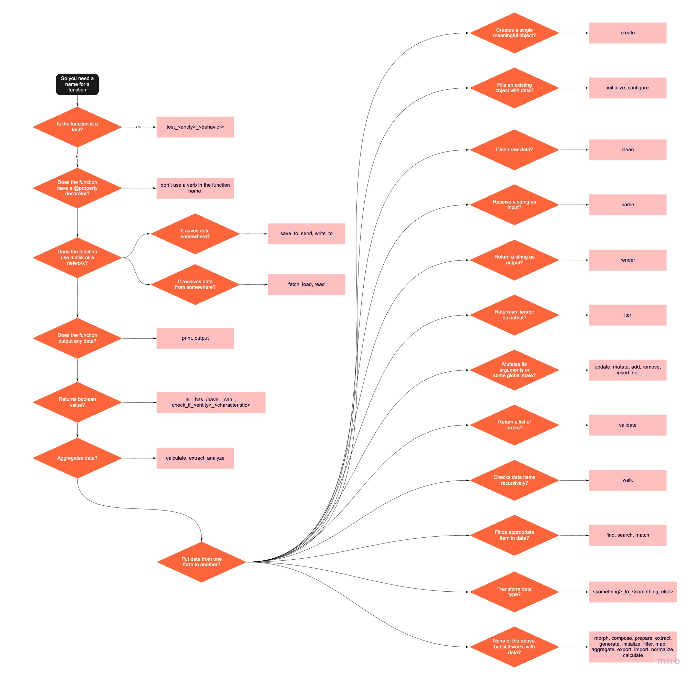

# Python functions naming: an algorithm
____
### The Motivation Part
Well, we all know that clear naming is crucial for readability.

Still, I see a function named `get_user` in every project. I renamed it to `fetch_user_from_db` in one project and to `clear_user_data` in another. As you can see, the functions had the same name but had nothing in common.

The most important part of a function name is a verb. The most popular verb is “get”, and it is a very lazy choice: it gives us none of the additional info. For example, you can replace “get” with “fetch”, then I would know that the function receives data from the network/disk.

Below you can see The Naming Algorithm: a connection between common verbs and their meanings. Use it for great good and forget about “get” and “process”.
### The Naming Algorithm

[download](assets/img/full_image.jpeg) image

1. Is the function a test? -> `test_<entity>_<behavior>`.
2. Does the function has a `@property` decorator? -> don’t use a verb in the function name.
3. Does the function use a disk or a network:
   - … to store data? -> `save_to`, `send`, `write_to`
   - … to receive data? -> `fetch`, `load`, `read`
4. Does the function output any data? -> `print`, `output`
5. Returns boolean value? -> `is_`, `has_/have_`, `can_`, `check_if_<entity>_<characteristic>`
6. Aggregates data? -> `calculate`, `extract`, `analyze`
7. Put data from one form to another:
    - Creates a single meaningful object? -> `create`
    - Fills an existing object with data? -> `initialize`, `configure`
    - Clean raw data? -> `clean`
    - Receive a string as input? -> `parse`
    - Return a string as output? -> `render`
    - Return an iterator as output? -> `iter`
    - Mutates its arguments or some global state? -> `update`, `mutate`, `add`, `remove`, `insert`, `set`
    - Return a list of errors? -> `validate`
    - Checks data items recursively? -> `walk`
    - Finds appropriate item in data? -> `find`, `search`, `match`
    - Transform data type? -> `<something>_to_<something_else>`
    - None of the above, but still works with data? -> Check one of those: `morph`, `compose`, `prepare`, `extract`, `generate`, `initialize`, `filter`, `map`, `aggregate`, `export`, `import`, `normalize`, `calculate`.

### The Blacklist  
Well, you might be surprised, but I don’t recommend using these verbs in functions names: `get`, `run`, `process`, `make`, `handle`, `do`, `main`, `compare`.

They all are too generic and has a more precise analogue almost always.

Of course, they come in handy when you’re writing generic code (e.g. framework), but there is usually a better option in most cases.

You can find a lot of other verbs in the previous section.